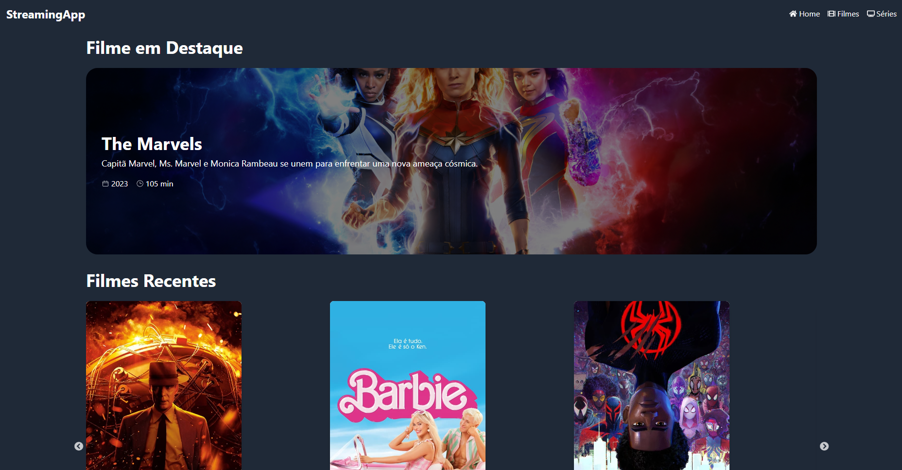

# StreamingApp



## Descrição

Este é um projeto desenvolvido para a cadeira de Desenvolvimento FrontEnd

## Funcionalidades

- Acessar a página de filmes e séries.
- Detalhes sobre um filme ou série do catálogo

## Tecnologias Utilizadas

- [React](https://reactjs.org/)
- [Tailwind CSS](https://tailwindcss.com)

## Pré-requisitos

- [Node.js](https://nodejs.org/)

## Instalação e Execução

Siga estas etapas para rodar o projeto na sua máquina local:

1. **Clone o repositório:**

   ```bash
   git clone https://github.com/beater27032001/streaming-site.git
   cd streaming-site

   ```

2. **Instale as dependências:**

   ```bash
   npm install
   ```

3. **Rode o aplicativo:**

   ```bash
   npm run dev
   ```

4. **Abra o navegador:**

   Abra o navegador e acesse `http://localhost:3000`.

## Acesse o Site

Você também pode acessar o aplicativo online através do link abaixo:

[StreamingApp - Versão Online](https://streaming-site-8h0vpsm0a-jos-carlos-paiva-santos-projects.vercel.app)